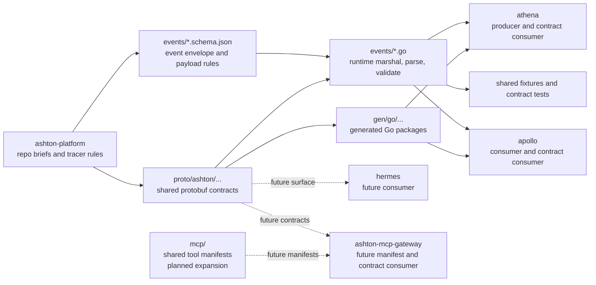

# ashton-proto

Shared contracts repo for the ASHTON platform.

> Nothing in this repo should become a runnable app. Its job is to define the
> shared wire contracts, validation rules, and runtime helpers that keep the
> service repos from drifting.

This repo is already part of the real executable stack. `athena` publishes the
current identified-arrival event through the shared helper here, and `apollo`
consumes that same helper instead of maintaining its own private JSON shape.

## Why This Repo Exists

`ashton-proto` exists so the platform can stay contract-first without stopping
at documentation theater. The current goal is not to create a giant speculative
schema catalog. The goal is to keep the real active surface small, versioned,
and reusable across repos.

## Architecture

The standalone Mermaid source for this flow lives at
[`docs/diagrams/ashton-proto-contract-flow.mmd`](docs/diagrams/ashton-proto-contract-flow.mmd).

## Current Contract Surface

| Surface | Path | Status | Purpose |
| --- | --- | --- | --- |
| Common health proto | [`proto/ashton/common/v1/health.proto`](proto/ashton/common/v1/health.proto) | Real | Shared health contract baseline |
| ATHENA read proto | [`proto/ashton/athena/v1/athena.proto`](proto/ashton/athena/v1/athena.proto) | Real | Presence source enums, occupancy types, and the first read RPC |
| Event envelope schema | [`events/envelope.schema.json`](events/envelope.schema.json) | Real | Shared outer event shape and subject naming discipline |
| Identified-arrival schema | [`events/athena.identified_presence.arrived.schema.json`](events/athena.identified_presence.arrived.schema.json) | Real | First active cross-repo event payload |
| Runtime helper | [`events/identified_presence_arrived.go`](events/identified_presence_arrived.go) | Real | Shared marshal, parse, source mapping, and timestamp validation |
| Generated Go packages | `gen/go/...` | Real | Consumer import path for Go services |
| MCP manifests | [`mcp/`](mcp/) | Planned | Shared manifest layer once routed tools become real |
| SQL naming guidance | [`sql/naming.md`](sql/naming.md) | Real | Cross-repo relational naming conventions |

## Tech Stack

| Layer | Technology | Status | Notes |
| --- | --- | --- | --- |
| Contract definition | Protobuf + Buf | Instituted | The package layout is now Buf-clean and generation is reproducible |
| Event validation | JSON Schema 2020-12 | Instituted | Active event schemas validate the first cross-repo subject |
| Runtime enforcement | Go helpers + explicit timestamp parsing | Instituted | Schema validation alone is not trusted for contract-critical semantics |
| Generated consumers | Go generated code | Instituted | `athena` and `apollo` import generated packages from this repo |
| Test discipline | Go tests + shared fixtures | Instituted | Repos should reuse shared fixture bytes instead of copying JSON strings |
| Tool manifest layer | MCP manifests | Planned | Deliberately deferred until the first routed tool surfaces exist |

## Ownership Rules

| Rule | Why It Exists |
| --- | --- |
| Lock the event envelope before widening payload detail | Keeps the first slices stable without speculating ahead of real producers |
| Keep subject names in `{service}.{entity}.{action}` form | Makes event routing and ownership obvious |
| Prefer additive change inside `v1` | Avoids unnecessary version sprawl while the surface is still small |
| Publish a runtime helper when a cross-repo message becomes active | Producers and consumers should not maintain private copies of the same wire contract |
| Keep repo expansion tracer-driven | New contracts should exist because a real slice needs them, not because a future repo might someday want them |

## Current State Block

### Already real in this repo

- `buf.yaml` and `buf.gen.yaml` are active and lint-clean
- generated Go code is tracked and compile-checked through consumer-style tests
- the first shared event envelope is locked
- `athena.identified_presence.arrived` is defined as both schema and shared
  runtime helper
- shared fixture bytes and validation tests exist for the active event path

### Real and active across repos

- `athena` publishes the identified-arrival event through this repo's helper
- `apollo` parses that same event through this repo's helper
- runtime timestamp and source validation now happen in one place instead of
  being recopied in each service

### Planned next

- expand contract surfaces only when a real tracer requires them
- add broader proto and manifest coverage for `apollo`, `hermes`, and the
  gateway once their first executable slices exist

### Deferred on purpose

- broad speculative schemas for features that do not yet have a tracer
- gateway-wide manifest expansion before any routed tool is real
- version churn for changes that are still additive inside the current surface

## Versioning And Drift Prevention

| Concern | Current Decision |
| --- | --- |
| Breaking changes | Avoid them while the active surface is still narrow; add new versions only when a real incompatibility exists |
| Producer and consumer drift | Use shared runtime helpers, not repo-local JSON structs |
| Timestamp and enum validation | Keep schema validation, then parse contract-critical values explicitly in runtime code |
| Test fixtures | Generate or reuse shared bytes from `ashton-proto` instead of duplicating hand-written payloads downstream |
| Contract expansion | Tie it to tracer scope so the repo stays small and defensible |

## Project Structure

| Path | Purpose |
| --- | --- |
| `proto/` | shared protobuf contracts |
| `events/` | event schemas, helper code, and fixtures |
| `gen/` | generated language bindings |
| `mcp/` | future shared manifest layer |
| `tests/` | contract import and schema validation checks |
| `docs/` | roadmap, runbook, ADR index, growing-pains log, and diagrams |

## Docs Map

- [Contract flow diagram](docs/diagrams/ashton-proto-contract-flow.mmd)
- [Roadmap](docs/roadmap.md)
- [Growing pains](docs/growing-pains.md)
- [Contract changes runbook](docs/runbooks/contract-changes.md)
- [ADR index](docs/adr/README.md)
- [Events overview](events/README.md)
- [Proto overview](proto/README.md)
- [MCP overview](mcp/README.md)
- [SQL naming conventions](sql/naming.md)

## Why This Repo Matters

For the platform itself, this repo keeps the first real cross-repo flow honest.
For the engineering narrative, it shows a stronger habit than "we wrote some
services and hoped the payloads matched": contracts are authored once, enforced
once, and reused everywhere that matters.
